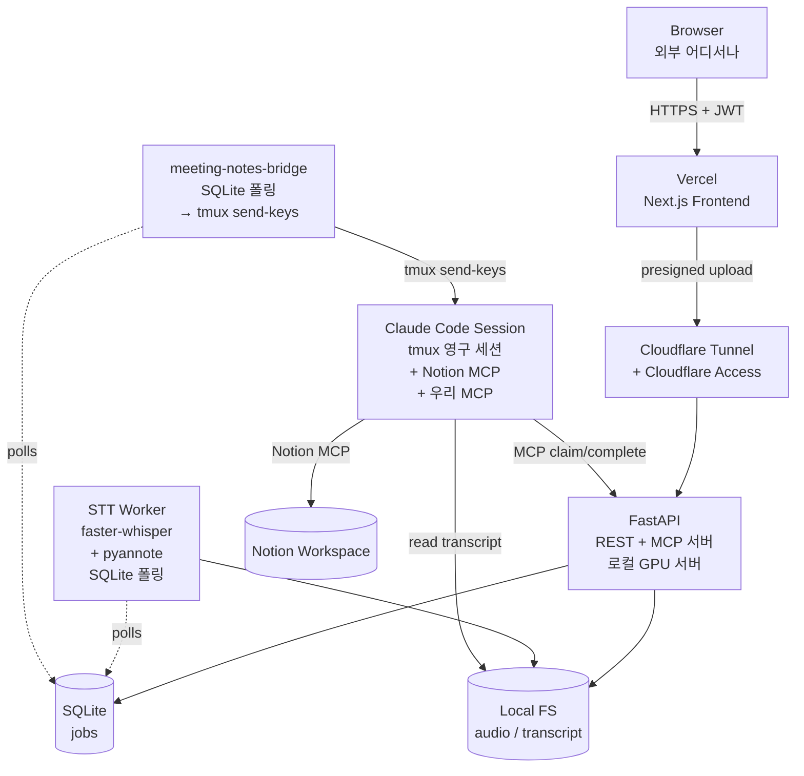
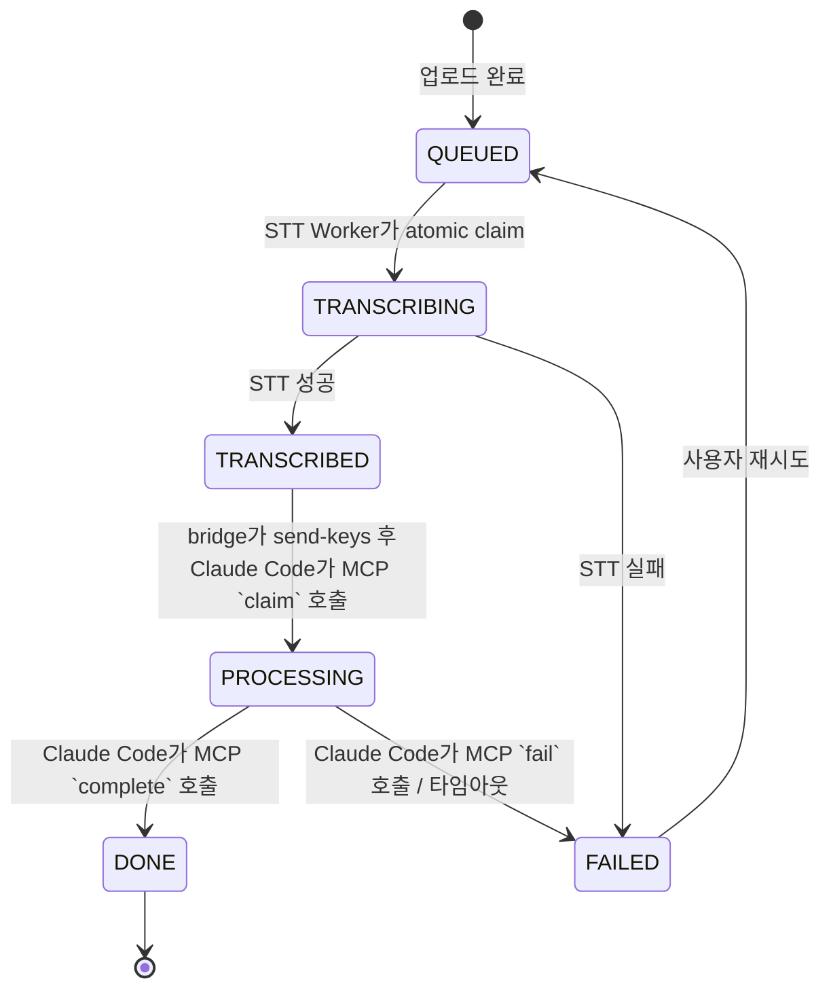
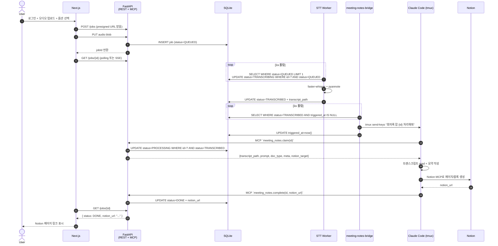
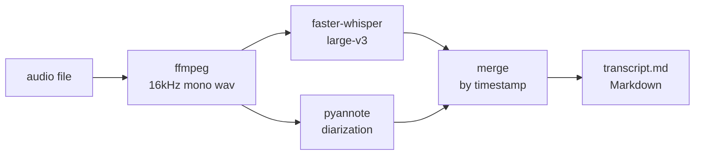
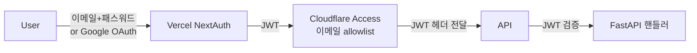

# meeting-notes-ai 설계 문서

> **Status**: Draft (Phase 1)
> **Last updated**: 2026-05-13
> **Owner**: 최재완

## 1. 개요

### 1.1 목적

음성 녹음 파일(회의·강의·세미나)을 업로드하면 자동으로 STT 처리하고, 로컬 Claude Code 세션에 요약·문서화·Notion 업로드를 위임하는 개인용 파이프라인.

컨셉은 SKT 에이닷 노트 / 네이버 클로바 노트와 동일하지만 **실시간 요약은 제공하지 않음** (배치 처리).

### 1.2 범위 (Phase 1)

| 항목 | 포함 |
|---|---|
| 본인이 외부에서 웹으로 오디오 업로드 | ✅ |
| Whisper 기반 STT + 화자 분리 | ✅ |
| 회의록/강의/세미나 3종 템플릿 선택 | ✅ |
| Claude Code가 Notion에 직접 업로드 | ✅ |
| 회원가입·멀티유저·BYOK | ❌ (Phase 2) |
| 실시간 요약 / 라이브 자막 | ❌ |
| 모바일 네이티브 앱 | ❌ (모바일 웹만) |

### 1.3 비기능 목표

| 항목 | 목표 |
|---|---|
| 외부 접근 | 회사망 밖에서 인증된 본인만 접근 |
| 1시간 분량 오디오 처리 시간 | 15분 이내 (STT 포함) |
| 동시 처리 | 1잡 직렬 처리 (Phase 1) |
| 데이터 보존 | 오디오 7일, 트랜스크립트 영구 |

---

## 2. 시스템 아키텍처

### 2.1 컴포넌트 토폴로지



### 2.2 컴포넌트 책임

| 컴포넌트 | 책임 | 책임 아님 |
|---|---|---|
| **Next.js (Vercel)** | 로그인 UI, 업로드 UI, 잡 상태 표시, 결과(Notion URL) 표시, 설정 화면 | 오디오 처리, LLM 호출 |
| **Cloudflare Tunnel + Access** | 회사망 백엔드를 외부에 안전하게 노출, 이메일 기반 0-Trust 한 겹 | 애플리케이션 인증 |
| **FastAPI (REST + MCP)** | 인증 검증, 업로드 수신, 잡 생성·상태 관리. MCP 서버로 Claude Code에 claim/complete 도구 노출 | LLM 호출, Notion API 호출 |
| **STT Worker** | 오디오 → 화자 분리된 텍스트 변환, 트랜스크립트 파일 저장 | 요약, 문서화 |
| **meeting-notes-bridge** | SQLite를 폴링하다 `TRANSCRIBED` 잡 발견 시 사용자의 tmux Claude Code 세션에 `tmux send-keys`로 프롬프트 푸시 | 잡 처리 로직 자체 |
| **Claude Code 세션 (사용자 본인)** | 사용자가 미리 띄워둔 tmux 영구 세션. bridge가 보낸 프롬프트 받으면 우리 MCP `claim` → 트랜스크립트 읽기 → Notion MCP로 페이지 생성 → 우리 MCP `complete` | (모든 LLM 작업 위임받음) |

### 2.3 설계 원칙

| 원칙 | 의미 |
|---|---|
| **위임 우선** | 우리 코드는 STT까지만 책임. 그 뒤는 Claude Code에 통째로 위임. Agent SDK·Notion API 클라이언트 자체 구현 금지. |
| **Slack-bridge 패턴 차용** | 트리거는 bridge 데몬의 `tmux send-keys` (인바운드), 결과 보고는 Claude Code가 우리 MCP 호출 (아웃바운드). slack-bridge.py와 동일 구조. |
| **템플릿이 곧 비즈니스 로직** | 문서 타입별 동작 차이는 모두 프롬프트 템플릿에서 표현. 백엔드 분기 최소화. |
| **단일 사용자 가정** | Phase 1은 본인 전용. 큐는 직렬, 인증은 최소. |

---

## 3. 데이터 모델

### 3.1 Job 엔티티

| 필드 | 타입 | 필수 | 설명 |
|---|---|---|---|
| `id` | UUID | ✅ | 잡 식별자 (== JOB_ID, 파일명에도 사용) |
| `created_at` | timestamptz | ✅ | 생성 시각 |
| `updated_at` | timestamptz | ✅ | 마지막 상태 변경 시각 |
| `doc_type` | enum | ✅ | `meeting` / `seminar` / `lecture` |
| `title` | text | ❌ | 사용자 지정 제목 (없으면 LLM이 생성) |
| `meta` | jsonb | ❌ | 참석자·날짜·태그 등 사용자 입력 메타 |
| `notion_target` | jsonb | ✅ | `{ kind: "database"\|"page", id: "..." }` |
| `audio_path` | text | ✅ | 로컬 FS 경로 |
| `transcript_path` | text | ❌ | STT 완료 후 채워짐 |
| `notion_url` | text | ❌ | Claude Code 완료 후 채워짐 |
| `status` | enum | ✅ | (아래 상태 머신 참조) |
| `error` | text | ❌ | 실패 시 사유 |
| `triggered_at` | timestamptz | ❌ | bridge가 `tmux send-keys`를 보낸 시각 (중복 송신 방지) |
| `expires_at` | timestamptz | ✅ | 오디오 자동 삭제 예정일 (생성 + 7일) |

### 3.2 상태 머신



### 3.3 파일 레이아웃 규약

| 경로 | 용도 | 생애주기 |
|---|---|---|
| `~/meeting-notes/audio/{JOB_ID}.{ext}` | 업로드된 원본 오디오 | 7일 후 자동 삭제 |
| `~/meeting-notes/transcripts/{JOB_ID}.md` | STT 결과 트랜스크립트 (Claude Code가 `claim` 응답의 `transcript_path`로 받아 직접 read) | 영구 |
| `~/meeting-notes/db.sqlite3` | 잡 상태 SQLite 파일 | 영구 (백업 권장) |
| `~/meeting-notes/logs/{JOB_ID}.log` | 워커·bridge 로그 | 30일 |

`.task.md` / `.done` / `.error` 같은 파일 IPC는 **없음**. 모든 시그널은 MCP 호출로 대체.

---

## 4. 처리 플로우

### 4.1 End-to-End 시퀀스



### 4.2 Bridge → Claude Code 트리거

사용자가 미리 띄워둔 단일 tmux Claude Code 세션에 bridge가 `tmux send-keys`로 프롬프트를 주입한다. slack-bridge.py(`~/scripts/slack-bridge/bridge.py`)의 패턴을 그대로 차용.

| 항목 | 값 |
|---|---|
| 타겟 지정 | 환경변수 `CC_TMUX_TARGET` (예: `meeting:0.0`) |
| 송신 방식 | `tmux send-keys -t <target> -l <text>` 후 `tmux send-keys -t <target> Enter` (키바인딩 회피 위해 `-l` literal 모드 + Enter 분리) |
| 세션 부재 시 | warning 로그 후 skip. `triggered_at`은 갱신하지 않음 → 다음 폴링에 재시도 |
| 중복 송신 방지 | `triggered_at IS NULL` 조건 + 송신 직후 UPDATE |
| 송신 문구 | `회의록 잡 {id} 처리해줘 (doc_type={doc_type})` — 짧게. 실제 내용은 Claude Code가 MCP `claim`으로 가져감 |
| 실패 복구 | 잡이 `PROCESSING` 상태로 N분 이상 머무르면 bridge가 `triggered_at` 리셋 + 재송신 (Phase 1엔 수동 재시도로 시작) |

Headless / interactive 같은 모드 구분 없음 — 항상 같은 세션에 send-keys.

### 4.3 STT 워커 처리 흐름



트랜스크립트 출력 형식:

```
# {파일명} (STT)
- duration: 01:23:45
- speakers: 3

## 본문
[00:00:12] **Speaker 1**: 안녕하세요 ...
[00:00:18] **Speaker 2**: 네 안녕하세요 ...
...
```

---

## 5. 외부 인터페이스

### 5.1 REST API (FastAPI ↔ Next.js)

| 메서드 | 경로 | 설명 | 인증 |
|---|---|---|---|
| `POST` | `/api/jobs` | 잡 생성 + presigned upload URL 발급 | JWT |
| `PUT` | `/api/jobs/{id}/audio` | 오디오 업로드 (multipart) | JWT |
| `GET` | `/api/jobs` | 잡 목록 (페이징) | JWT |
| `GET` | `/api/jobs/{id}` | 잡 상세 + 상태 | JWT |
| `GET` | `/api/jobs/{id}/events` | 상태 변경 SSE 스트림 | JWT |
| `POST` | `/api/jobs/{id}/retry` | 실패한 잡 재시도 | JWT |
| `DELETE` | `/api/jobs/{id}` | 잡 삭제 (오디오·트랜스크립트 함께) | JWT |
| `GET` | `/api/settings` | 사용자 설정 조회 | JWT |
| `PUT` | `/api/settings` | 사용자 설정 갱신 | JWT |

#### POST /api/jobs 요청 페이로드

| 필드 | 타입 | 필수 | 설명 |
|---|---|---|---|
| `doc_type` | string | ✅ | `meeting` / `seminar` / `lecture` |
| `title` | string | ❌ | 제목 힌트 |
| `meta` | object | ❌ | 자유 메타 (참석자, 날짜 등) |
| `notion_target` | object | ✅ | `{ kind, id }` |
| `audio_filename` | string | ✅ | 업로드할 파일명 (확장자 검증용) |

### 5.2 사용자 설정 스키마

| 필드 | 타입 | 설명 |
|---|---|---|
| `notion_targets` | array | 즐겨찾는 Notion 페이지/DB 목록 (선택 UI에 노출) |
| `default_doc_type` | enum | 잡 생성 시 기본 선택값 |
| `prompt_overrides` | object | 타입별 프롬프트 커스텀 (선택) |

Phase 1에서는 설정 화면 없이 환경변수 + JSON 파일로 시작해도 무방.

### 5.3 MCP 서버 (FastAPI ↔ Claude Code)

FastAPI에 마운트되는 MCP 서버. Claude Code 설정(`~/.claude/settings.json` 또는 `mcpServers`)에 다음과 같이 등록한다:

```json
{
  "mcpServers": {
    "meeting-notes": {
      "type": "http",
      "url": "http://localhost:8000/mcp",
      "headers": { "Authorization": "Bearer <local-token>" }
    }
  }
}
```

#### 노출 도구

| Tool | Input | Output | 부작용 |
|---|---|---|---|
| `meeting_notes.list_pending` | (none) | `[{id, doc_type, title, created_at}]` | - |
| `meeting_notes.claim` | `{job_id}` | `{transcript_path, prompt, doc_type, meta, notion_target: {kind, id}, completion_contract}` | atomic: `status=TRANSCRIBED → PROCESSING` |
| `meeting_notes.complete` | `{job_id, notion_url}` | `{ok: true}` | `status=PROCESSING → DONE`, `notion_url` 채움 |
| `meeting_notes.fail` | `{job_id, reason}` | `{ok: true}` | `status=PROCESSING → FAILED`, `error` 채움 |

#### `claim` 응답 필드

| 필드 | 타입 | 설명 |
|---|---|---|
| `transcript_path` | string | `~/meeting-notes/transcripts/{JOB_ID}.md` — Claude Code가 직접 read |
| `prompt` | string | 해당 `doc_type`의 템플릿 본문 (서버가 치환 완료) |
| `doc_type` | enum | `meeting` / `seminar` / `lecture` |
| `meta` | object | 사용자가 잡 생성 시 입력한 메타 (제목·참석자 등) |
| `notion_target` | `{kind, id}` | `kind`: `database` / `page`, `id`: 노션 ID |
| `completion_contract` | string | "처리 완료 후 `meeting_notes.complete(job_id, notion_url)` 호출 필수" 안내 문구 |

#### 전송·보안

| 항목 | 값 |
|---|---|
| Transport | HTTP streamable |
| 로컬 URL | `http://localhost:8000/mcp` |
| 외부 노출 | Cloudflare Tunnel + Access (휴대폰에서 트리거할 때) |
| 인증 | Bearer 토큰 (env 발급, 로컬 한정 토큰과 원격용 토큰 분리 권장) |

---

## 6. 인증·보안

### 6.1 인증 레이어



| 계층 | 역할 | Phase 1 구현 |
|---|---|---|
| NextAuth | 사용자 식별, JWT 발급 | 본인 이메일 단일 계정 |
| Cloudflare Access | 네트워크 경계에서 0-Trust 한 겹 | 본인 이메일 allowlist |
| FastAPI JWT 검증 | 애플리케이션 인증 | NextAuth가 서명한 JWT 검증 |

### 6.2 시크릿 관리

| 시크릿 | 저장 위치 | 비고 |
|---|---|---|
| `ANTHROPIC_API_KEY` | Claude Code 본인 세션의 OAuth 또는 env | 우리 백엔드 DB에 저장 안 함 |
| Notion integration token | Claude Code의 `~/.claude/settings.json` MCP 설정 | 우리 백엔드 DB에 저장 안 함 |
| NextAuth secret / Cloudflare Tunnel token | Vercel env + Cloudflare 대시보드 | - |
| SQLite DB 파일 | 로컬 FS 권한으로 격리 | 자격증명 없음 |

**Phase 1에서 우리 DB에는 어떤 LLM·Notion 시크릿도 저장하지 않음.** 이게 Phase 2 (BYOK)로 갈 때 가장 큰 차이점.

### 6.3 위협 모델 (Phase 1)

| 위협 | 완화 |
|---|---|
| 외부 사용자가 백엔드 접근 시도 | Cloudflare Access 이메일 allowlist + JWT |
| 업로드된 오디오 유출 | 로컬 FS, 외부 접근 차단, 7일 자동 삭제 |
| Claude Code 프롬프트 인젝션 (트랜스크립트 내용으로) | 템플릿이 입력을 명확한 구분자로 감싸고, MCP 권한을 필요한 도구로 한정 |
| Notion 토큰 유출 | 사용자 로컬 머신의 Claude Code 설정에만 존재 |

---

## 7. 프롬프트 템플릿

### 7.1 공통 구조

모든 템플릿은 동일한 골격:

| 섹션 | 목적 |
|---|---|
| Role | 작성자 페르소나 정의 |
| Input contract | 트랜스크립트 파일 위치 + 메타 형식 |
| Output structure | 문서 타입별 섹션 구조 명세 |
| Notion contract | 타겟 위치 + 블록 매핑 규칙 |
| Completion contract | 완료 시 MCP `meeting_notes.complete(job_id, notion_url)` 호출, 실패 시 `meeting_notes.fail(job_id, reason)` |

### 7.2 타입별 출력 구조 차이

| 섹션 | meeting | seminar | lecture |
|---|---|---|---|
| 제목 | ✅ | ✅ | ✅ |
| 일시·참석자 | ✅ | ✅ (발표자) | ✅ (강사) |
| 핵심 결정사항 | ✅ | — | — |
| 액션 아이템 | ✅ | ✅ (후속 과제) | ✅ (실습 과제) |
| 논의/발표 요약 | ✅ | ✅ | — |
| 강의 개념 정리 | — | — | ✅ |
| Q&A 정리 | — | ✅ | ✅ |
| 원문 인용 (timestamp) | 5개 이내 | 5개 이내 | 10개 이내 |

### 7.3 위치

| 경로 | 설명 |
|---|---|
| `prompts/meeting.md` | 회의록 |
| `prompts/seminar.md` | 세미나 |
| `prompts/lecture.md` | 강의 |
| `prompts/_base.md` | 공통 헤더·완료 규약 |

새 문서 타입 추가 = 템플릿 파일 추가 + `doc_type` enum 추가. 백엔드 비즈니스 로직 변경 없음.

---

## 8. 배포 토폴로지

### 8.1 환경 분리

| 환경 | 프론트엔드 | 백엔드 | 비고 |
|---|---|---|---|
| local-dev | `localhost:3000` | `localhost:8000` | 로컬 개발 |
| production | Vercel (`*.vercel.app` 또는 커스텀 도메인) | 로컬 GPU 서버 + Cloudflare Tunnel | Phase 1 운영 환경 |

### 8.2 로컬 서버 구성

| 서비스 | 실행 방식 | 비고 |
|---|---|---|
| FastAPI | `uv run uvicorn` (systemd unit) | REST API + MCP 서버 한 프로세스 |
| STT 워커 | 별도 프로세스 (systemd unit) | GPU 점유, SQLite 1s 폴링 |
| meeting-notes-bridge | 별도 프로세스 (systemd unit) | SQLite 1s 폴링 → `tmux send-keys`. slack-bridge.py 패턴 |
| SQLite | 파일 (`~/meeting-notes/db.sqlite3`) | 외부 서비스 없음 |
| cloudflared | systemd unit | 터널 |
| Claude Code | 사용자가 미리 띄워둔 tmux 영구 세션 | 사용자 본인 인증, `mcpServers`에 `meeting-notes` 등록 필요 |

### 8.3 디렉토리 구조

```
meeting-notes-ai/
├── apps/
│   ├── web/                # Next.js (Vercel)
│   └── api/                # FastAPI (REST + MCP 서버 마운트)
├── workers/
│   ├── stt/                # faster-whisper + pyannote
│   └── bridge/             # meeting-notes-bridge (tmux send-keys 데몬)
├── prompts/                # meeting.md / seminar.md / lecture.md / _base.md
├── infra/
│   ├── systemd/            # unit 파일들 (api / stt / trigger / cloudflared)
│   └── cloudflared/        # tunnel config
├── docs/
│   └── design.md           # 본 문서
└── temp/                   # 작업 산출물 (gitignore)
```

---

## 9. 마일스톤

| # | 범위 | 완료 기준 |
|---|---|---|
| M1 | ✅ | STT PoC (화자분리 없이). `workers/stt/transcribe.py` CLI |
| M1.5 | ⏸ 보류 | 화자분리 (pyannote). HF 라이센스 동의 필요 — STT 품질 확인 후 결정 |
| M2 | ✅ | MCP + bridge PoC. 자동 E2E 검증됨 (잡 2건 DONE) |
| M3 | ✅ | FastAPI + SQLite + REST CRUD + 업로드 + MCP `/mcp` 마운트 (`apps/api/main.py`) |
| M4 | ✅ | STT 워커 자동 폴링 (`workers/stt/worker.py`). 업로드 → 자동 전사 → bridge → Notion 한 사이클 |
| M5 | ✅ | Next.js + Apple-style UI (`apps/web/`). 잡 목록·업로드·상세 3페이지 |
| M6 | ⏸ 제외 | Cloudflare Tunnel + Vercel 배포 — 외부 계정 필요. 사용자 직접 |
| M7 | 🔄 1차 | `prompts/_base.md` + meeting/seminar/lecture 템플릿. 운영 데이터 튜닝은 진행 중 |
| M8 | 🔄 1차 | `scripts/cleanup.py` (7일 자동 삭제), `~/meeting-notes/logs/`, `POST /jobs/{id}/retry` |
| Docker | ✅ | `docker-compose.yml` + `infra/docker/Dockerfile{,.stt,.web}`. bridge 만 호스트에서 실행 |

---

## 10. 의도적으로 제외한 것 (Phase 2 후보)

| 항목 | 사유 |
|---|---|
| 회원가입 / 멀티유저 | Phase 1은 본인 전용 |
| BYOK (사용자별 Anthropic/Notion 키 저장) | 시크릿 envelope 암호화 등 별도 설계 필요 |
| 실시간 요약 / 라이브 자막 | 컨셉상 비대상 |
| 모바일 네이티브 앱 | 모바일 웹으로 충분 |
| Notion 외 출력 (Confluence, Slack 등) | 우선순위 낮음 |
| 자체 Agent SDK / Notion API 클라이언트 구현 | Claude Code 위임으로 대체 |
| 화자 이름 자동 매핑 | Phase 1은 `Speaker 1/2/3`로 충분, 사용자가 메타에 매핑 입력 |
